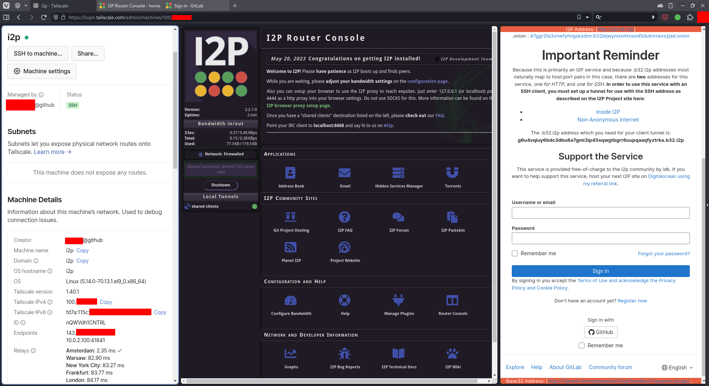

Invisible Internet over Tailscale
=================================


Private router to access the Invisible Internet via Tailscale IPN



## Usage

```
$ podman run -d --name=i2p --hostname=i2p \
     -e TAILSCALE_AUTH_KEY=tskey-... \
     ghcr.io/spotsnel/i2pscale:latest
```

and get the node IP with

```
$ tailscale ip -4 i2p
```

and use with port `4444`, `4445` and `7657`

